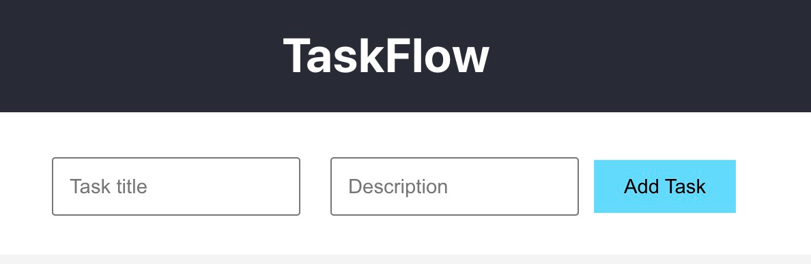
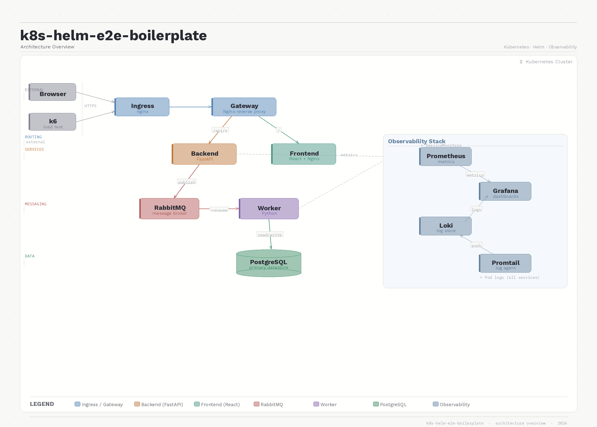
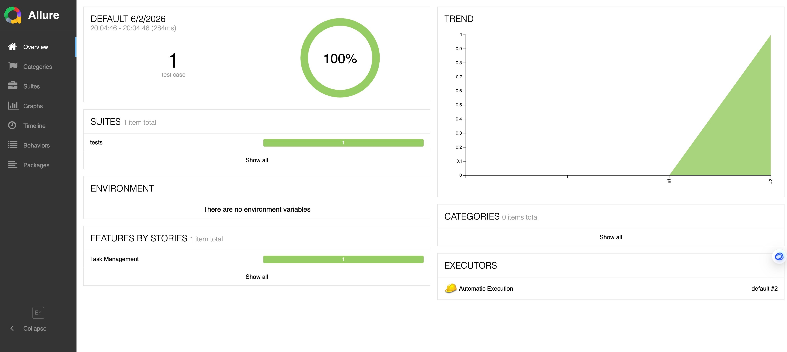

# K8s Helm E2E Boilerplate — TaskFlow

A full-stack boilerplate demonstrating a production-like Kubernetes workflow: multi-service application deployed via Helm, full observability stack (Prometheus + Grafana + Loki), E2E testing with Playwright/Pytest, and load testing with k6.



---

## Architecture Overview



### Request Flow

1. User submits a task via the React frontend.
2. The request goes through the Nginx Ingress → Gateway → Backend (`POST /tasks`).
3. Backend saves the task to PostgreSQL (status: `PENDING`) and publishes a `TaskCreated` event to RabbitMQ.
4. Backend returns `202 Accepted` immediately.
5. Worker consumes the event, simulates processing (`RUNNING` → 5s delay → `COMPLETED`), and updates PostgreSQL.
6. Frontend polls `GET /tasks` to show the updated status.

### Components

| Component | Technology | Role |
|-----------|-----------|------|
| Frontend | React + Nginx | Static UI served via Nginx |
| Gateway | Nginx | Reverse proxy: routes `/api/*` → Backend, `/` → Frontend |
| Backend | Python FastAPI | REST API, task CRUD, publishes to RabbitMQ |
| Worker | Python asyncio + aio_pika | Consumes RabbitMQ messages, updates task status |
| Message Broker | RabbitMQ | Async task dispatching |
| Database | PostgreSQL | Persistent task storage |
| Observability | Prometheus + Grafana + Loki | Metrics, dashboards, log aggregation |
| E2E Testing | Playwright + Pytest + Allure | Browser-level automated test runner (Helm Job/CronJob) |
| Load Testing | k6 | HTTP load testing with Prometheus integration |

---

## Repository Structure

```
.
├── charts/
│   ├── taskflow/          # Main application Helm chart
│   │   ├── templates/     # Backend, Frontend, Gateway, Worker, Ingress ...
│   │   └── values.yaml    # Image tags, resource limits, credentials
│   ├── observability/     # Prometheus + Grafana + Loki + Promtail
│   └── e2e-runner/        # Playwright/Pytest E2E test Job/CronJob
├── src/
│   ├── frontend/          # React application
│   ├── gateway/           # Nginx gateway config
│   ├── backend/           # FastAPI service (main.py, models.py)
│   └── worker/            # Async worker service
├── k6_load_test/          # k6 load test scripts
├── scripts/
│   └── port-forward-all.sh  # One-command local port forwarding
└── README.md
```

---

## Prerequisites

| Tool | Purpose |
|------|---------|
| Docker | Building images |
| Kubernetes cluster | Minikube, Kind, or cloud provider |
| `kubectl` | Cluster management |
| Helm 3+ | Chart deployment |
| NGINX Ingress Controller | Cluster-level ingress |
| `k6` _(optional)_ | Load testing |

---

## Quick Start

### Step 1 — Build and push Docker images

The chart uses pre-built images (`gto310/taskflow-*`). To use your own:

```bash
# Replace <your_repo> with your Docker Hub username
docker build -t <your_repo>/taskflow-backend:v1.0.0  ./src/backend
docker build -t <your_repo>/taskflow-frontend:v1.0.0 ./src/frontend
docker build -t <your_repo>/taskflow-gateway:v1.0.0  ./src/gateway
docker build -t <your_repo>/taskflow-worker:v1.0.0   ./src/worker

docker push <your_repo>/taskflow-backend:v1.0.0
docker push <your_repo>/taskflow-frontend:v1.0.0
docker push <your_repo>/taskflow-gateway:v1.0.0
docker push <your_repo>/taskflow-worker:v1.0.0
```

Then update `charts/taskflow/values.yaml`:

```yaml
backend:
  image:
    repository: <your_repo>/taskflow-backend
    tag: v1.0.0

frontend:
  image:
    repository: <your_repo>/taskflow-frontend
    tag: v1.0.0

worker:
  image:
    repository: <your_repo>/taskflow-worker
    tag: v1.0.0
```

### Step 2 — Install the NGINX Ingress Controller (once per cluster)

```bash
helm repo add ingress-nginx https://kubernetes.github.io/ingress-nginx
helm repo update
helm upgrade --install ingress-nginx ingress-nginx/ingress-nginx \
  -n ingress-nginx --create-namespace

# Wait until the controller is running
kubectl get pods -n ingress-nginx
```

### Step 3 — Install Helm chart dependencies

```bash
cd charts/taskflow
helm dependency build
cd ../..

cd charts/observability
helm repo add prometheus-community https://prometheus-community.github.io/helm-charts
helm repo add grafana https://grafana.github.io/helm-charts
helm repo update
helm dependency build
cd ../..
```

### Step 4 — Deploy the observability stack

```bash
helm upgrade --install observability ./charts/observability \
  -n observability --create-namespace
```

This installs:
- **Prometheus** — scrapes metrics from Backend, Gateway, RabbitMQ, and PostgreSQL via `ServiceMonitors`
- **Grafana** — dashboards (default credentials: `admin` / `prom-operator`)
- **Loki + Promtail** — log aggregation from all pods

Grafana default credentials when installing via the bundled `observability` chart:

- Username: `admin`
- Password: `strongpassword`

### Step 5 — Deploy the application

```bash
helm upgrade --install taskflow ./charts/taskflow \
  -n taskflow --create-namespace
```

Watch pods come up:

```bash
kubectl get pods -n taskflow -w
```

Expected output (all pods `Running`):

```
NAME                                  READY   STATUS    
taskflow-backend-xxx                  1/1     Running
taskflow-frontend-xxx                 1/1     Running
taskflow-gateway-xxx                  2/2     Running   # nginx + metrics exporter
taskflow-worker-xxx                   1/1     Running
taskflow-postgresql-0                 1/1     Running
taskflow-rabbitmq-0                   1/1     Running
```

> **Troubleshooting**: `CrashLoopBackOff` on the worker usually indicates RabbitMQ/PostgreSQL connectivity or credential mismatch. Check with:
> ```bash
> kubectl logs -n taskflow -l app.kubernetes.io/component=worker --tail=50
> ```

### Step 6 — Access the application

Run the port-forward helper script to open all endpoints in one command:

```bash
./scripts/port-forward-all.sh
```

| Endpoint | URL |
|----------|-----|
| Application (via Ingress) | http://localhost:8080 |
| Grafana | http://localhost:3000 |
| Prometheus | http://localhost:9090 |
| PostgreSQL | localhost:5432 |

Or forward only the app:

```bash
kubectl port-forward svc/taskflow-gateway -n taskflow 8080:80
```

---

## Verify the Deployment

```bash
# Check all pods are running
kubectl get pods -n taskflow

# Check services
kubectl get svc -n taskflow

# Run the built-in Helm test (curl against backend health)
helm test taskflow -n taskflow
```

---

## E2E Testing (e2e-runner)

The `e2e-runner` chart runs a Playwright + Pytest test suite inside the cluster as a Kubernetes Job.

### Build the test image

Use tests from this project directory:

- `https://github.com/bridgeshi85/playwright-pytest-allure-framework/tree/main/playwright-automation-test`

```bash
# The default image is gto310/playwright-test-agent:latest
# To use your own test image (build from playwright-automation-test directory):
docker build -t <your_repo>/playwright-test-agent:latest ./playwright-automation-test
kind load docker-image <your_repo>/playwright-test-agent:latest  # if using Kind
```

### Run as a one-time Job

```bash
helm upgrade --install e2e-runner ./charts/e2e-runner \
  -n taskflow \
  --set envConfig.baseUrl="http://taskflow-gateway.taskflow.svc.cluster.local:80" \
  --set job.image.repository=gto310/playwright-test-agent
```

### Watch test execution and retrieve artifacts

```bash
# Watch the job
kubectl get jobs -n taskflow -w

# Stream logs
kubectl logs -n taskflow -l app.kubernetes.io/name=e2e-runner -f

# Copy artifacts to local
POD=$(kubectl get pod -n taskflow -l app.kubernetes.io/name=e2e-runner -o name | head -1)
kubectl cp -n taskflow ${POD}:/output/logs      ./allure-results
kubectl cp -n taskflow ${POD}:/output/reports   ./allure-reports
kubectl cp -n taskflow ${POD}:/output/screenshots ./screenshots
```

### View Allure report

Make sure `port-forward-all.sh` is running (or forward manually):

```bash
kubectl port-forward -n taskflow svc/e2e-runner-allure-service 5050:5050
```

Then open the latest report in your browser:

[http://localhost:5050/allure-docker-service/projects/default/reports/latest/index.html?redirect=false](http://localhost:5050/allure-docker-service/projects/default/reports/latest/index.html?redirect=false)



### Schedule nightly tests (CronJob)

```bash
helm upgrade --install e2e-runner ./charts/e2e-runner \
  -n taskflow \
  --set job.kind=CronJob \
  --set job.cronSchedule="0 2 * * *" \
  --set test.pytest.markers="regression"
```

### Key configuration options

| Parameter | Description | Default |
|-----------|-------------|---------|
| `job.kind` | `Job` or `CronJob` | `Job` |
| `job.cronSchedule` | Cron expression | `0 2 * * *` |
| `job.image.repository` | E2E test image | `gto310/playwright-test-agent` |
| `envConfig.baseUrl` | Target URL (in-cluster) | `http://taskflow-gateway.taskflow.svc.cluster.local:80` |
| `persistence.enabled` | Persist artifacts to PVC | `true` |
| `persistence.pvc.size` | PVC size | `5Gi` |
| `helmTest.enabled` | Register as `helm test` hook | `true` |

---

## Load Testing (k6)

The `k6_load_test/` directory contains a mixed-load script that sends `POST /api/tasks` and `GET /api/tasks` traffic with `X-Request-ID` headers for distributed tracing.

### Prerequisites

```bash
# macOS
brew install k6
```

### Run

Make sure `port-forward-all.sh` is running first, then:

```bash
# Default: 20 VUs for 50s
k6 run k6_load_test/taskflow-loadtest.js

# Custom concurrency and duration
BASE_URL=http://localhost:8080 VUS=40 DURATION=5m k6 run k6_load_test/taskflow-loadtest.js
```

Built-in thresholds: error rate `< 1%`, P95 latency `< 500ms`.

### Observe during load test

Open Grafana at http://localhost:3000 and watch:

- `http_requests_total` / `http_request_duration_seconds` — backend HTTP metrics
- `rabbitmq_*` — message queue depth, delivery rate, connections
- Loki logs — search by `X-Request-ID` to trace individual requests end-to-end

---

## Observability Details

| Component | How metrics are collected |
|-----------|--------------------------|
| Backend | `prometheus-fastapi-instrumentator` exposes `/metrics`; scraped by ServiceMonitor |
| Gateway | `nginx-prometheus-exporter` sidecar scrapes `/stub_status`; scraped by ServiceMonitor |
| RabbitMQ | Built-in Prometheus plugin; scraped by ServiceMonitor |
| PostgreSQL | `postgres-exporter` sidecar; scraped by ServiceMonitor |
| Logs | Promtail DaemonSet ships all pod logs to Loki |

Grafana default login: `admin` / `prom-operator`

---

## License

MIT — see [LICENSE](LICENSE).
